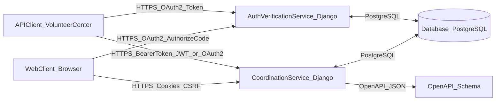
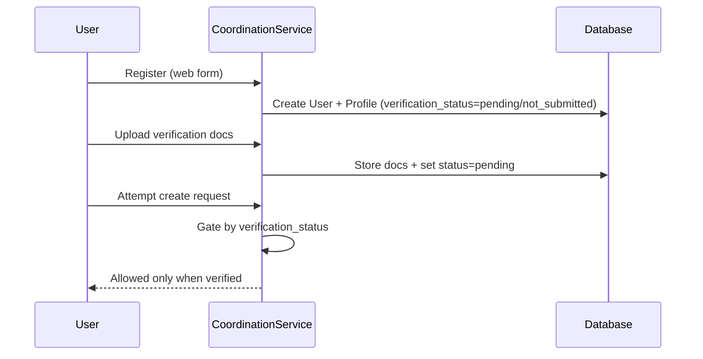
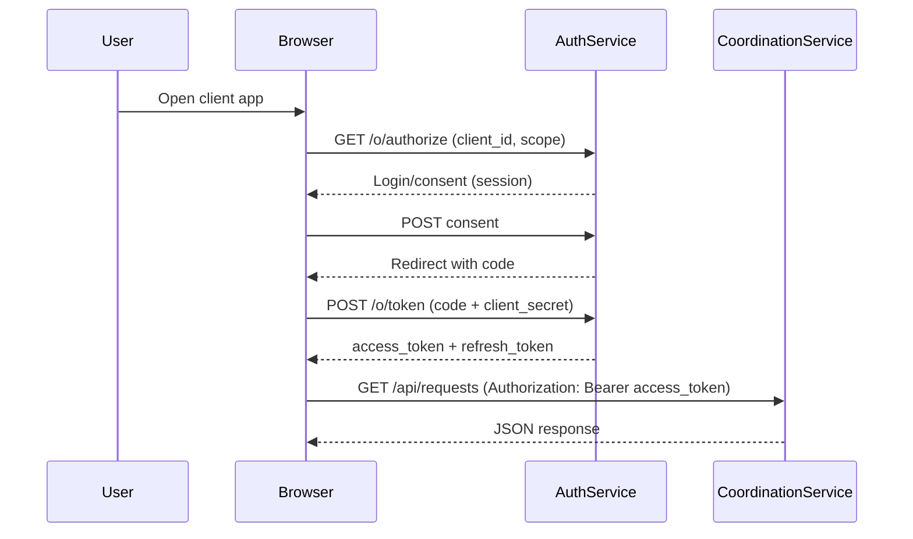
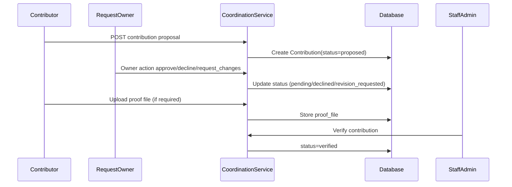

# Architecture (Coordination + Auth/Verification)

This repository implements a coordination system for volunteer/humanitarian help with **secure user verification**.

## Components

### Service entrypoints
- **Coordination service** (UI + REST API): `diploma_project/wsgi_coordination.py` + `diploma_project/urls_coordination.py`
- **Auth/Verification service** (OAuth2 endpoints): `diploma_project/wsgi_auth.py` + `diploma_project/urls_auth.py`

Both services share the same Django settings module and the same database for consistency.

## Network interfaces

### Coordination REST API
- Base path: `/api/`
- OpenAPI schema: `/api/schema/`
- Swagger UI: `/api/docs/swagger/`
- ReDoc: `/api/docs/redoc/`

### Auth endpoints
- OAuth2 base: `/o/` (HTML index with links); flows use `/o/authorize/`, `POST /o/token/`, etc.
- JWT endpoints (API login/refresh):\n+  - `/api/auth/jwt/token/`\n+  - `/api/auth/jwt/refresh/`

## Authentication & authorization

### Web UI (browser)
- Uses **Django sessions** with CSRF protection (cookie-based).

### REST API (machine-to-machine / integrations)
API accepts **Bearer tokens** via `Authorization: Bearer <token>`:\n+- **JWT** (SimpleJWT): for direct API login in controlled environments.\n+- **OAuth2 access tokens** (django-oauth-toolkit): for standard client integrations.\n+
Authorization (RBAC) is enforced by server-side checks (staff/superuser + verified users + ownership rules).

## Sequence diagrams

### Registration → verification → ability to post

### OAuth2: authorize code → access token → call API

### Contribution workflow (propose → approve → proof → verify)

## Local run (two services)

If Docker is installed, use `docker-compose.yml` to start:\n+- coordination: `http://localhost:8000`\n+- auth: `http://localhost:8001` (OAuth2 endpoints)\n+\n+Both point to the same Postgres container.\n+
