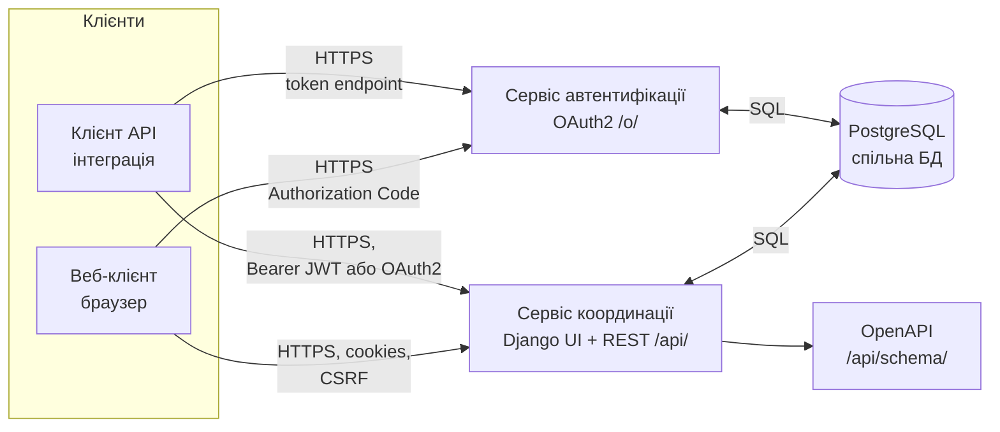
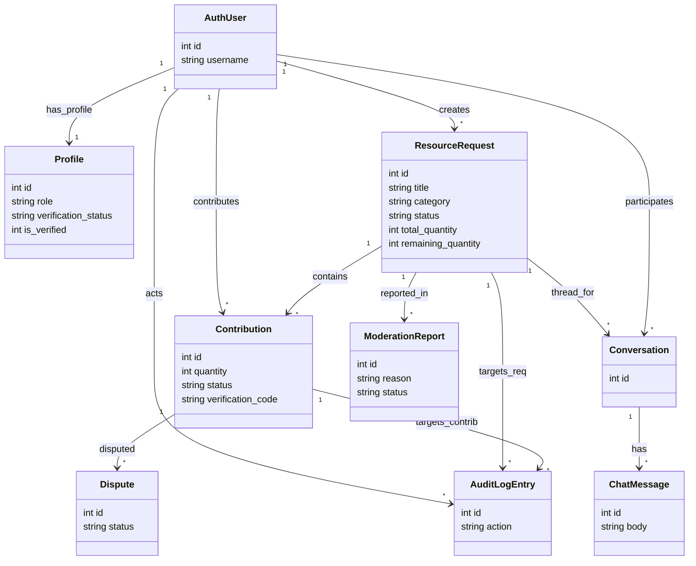
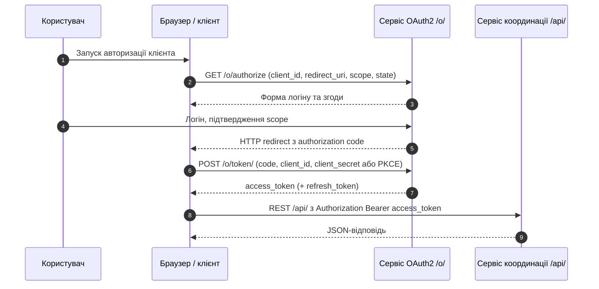
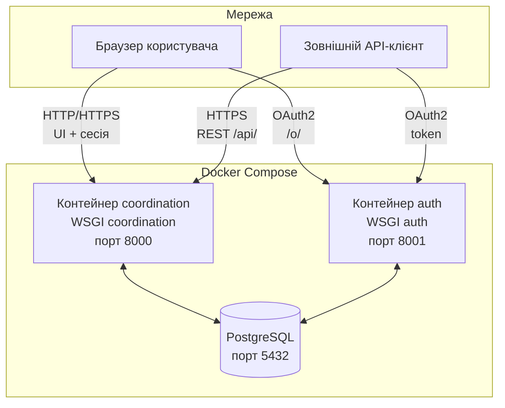

# Рисунки розділу 2 (Mermaid)

Експорт у PNG/SVG: [mermaid.live](https://mermaid.live) або draw.io → **Insert → Advanced → Mermaid**.

---

## Рисунок 2.1 — Компонентна схема системи



---

## Рисунок 2.2 — Інформаційна модель даних (ER, узагальнено)

**Важливо при копіюванні:** у поле Mermaid (mermaid.live, draw.io) вставляй **лише** код діаграми — **без** рядків ` ```mermaid ` і ` ``` ` на початку й в кінці. Якщо інструмент сам додає обгортку — не дублюй її.

**Чому був `No diagram type detected`:** у багатьох середовищах (зокрема вбудований Mermaid у **draw.io**) тип **`erDiagram` не підключений або відключений** — парсер не розпізнає діаграму. Нижче — варіант **`classDiagram`**, який зазвичай рендериться скрізь; семантика та сама, що в ER.

Клас **`ResourceRequest`** на діаграмі = модель **`Request`** у коді Django (ім’я змінено, щоб уникнути збігів із глобальним `Request` у JS у деяких рендерерах).



У підписі до рисунка в Word: *зв’язок `AuthUser` → `Conversation` з міткою `participates` відображає дві ролі через поля `contributor_id` та `receiver_id`*. Клас **`ChatMessage`** = модель **`Message`**.

### Альтернатива: `erDiagram` (лише для Mermaid ≥ 8.6 з увімкненим ER)

Якщо на [mermaid.live](https://mermaid.live) `erDiagram` працює — можна лишити ER-нотацію там; у draw.io надійніше використовувати **`classDiagram`** вище.

---

## Рисунок 2.4 — Діаграма послідовностей OAuth2 і виклик REST API



---

## Рисунок 2.9 — Розгортання (Docker Compose, логічна схема)



> Порти **8000 / 8001** — як у `ARCHITECTURE.md` для локального запуску; для продакшену підстав власні значення або підпис «умовні позначення».
