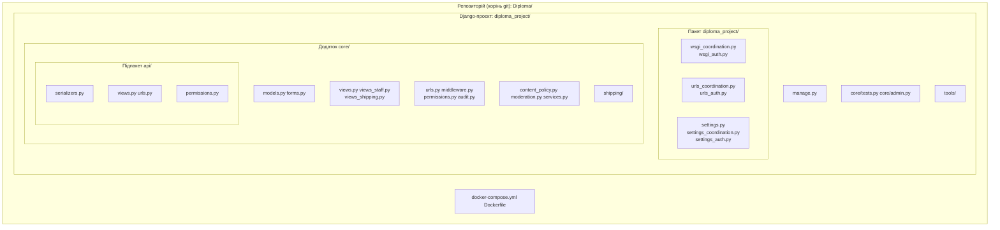
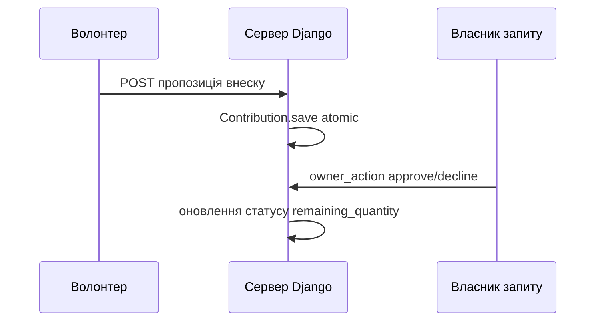
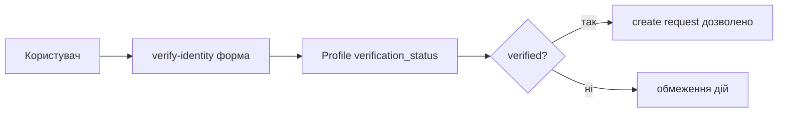
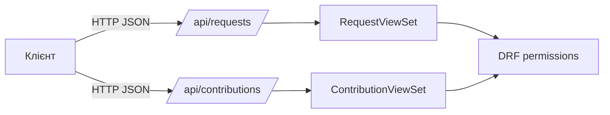
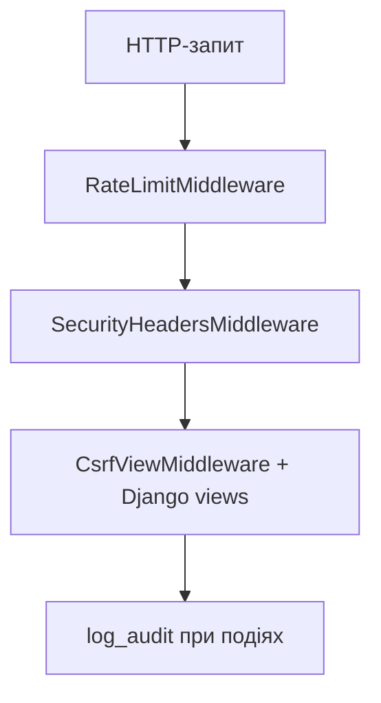

# Рисунки розділу 3 (Mermaid)

Експорт у PNG/SVG: [mermaid.live](https://mermaid.live) або draw.io → **Insert → Advanced → Mermaid**.  
Вставляй код **без** рядків ` ```mermaid ` / ` ``` `, якщо інструмент додає їх сам.

---

## Рисунок 3.1 — Структура проєкту та ключові модулі

Узагальнена логічна структура каталогу **`diploma_project/`** (корінь репозиторію з `manage.py`).



**Підпис у Word:**  
`Рисунок 3.1 – Логічна структура програмного проєкту та розподіл ключових модулів`

**Примітка під рисунком (1–2 речення):**  
*Файли `docker-compose.yml` / `Dockerfile` розташовані в корені репозиторію поруч із каталогом `diploma_project/`. Пакет `diploma_project/` (всередині проєкту) та додаток `core/` — сусідні; `core/api/` — REST-шар.*

---

## Рисунки 3.2–3.5 — як зробити (зазвичай це **скриншоти**)

Запусти проєкт (`docker compose up` з кореня репозиторію або `runserver` за твоєю інструкцією). Координаційний UI зазвичай на **`http://127.0.0.1:8000/`** (як у `ARCHITECTURE.md`).

**Загальне для всіх скринів:** ширина вікна ~1280 px; **замаскуй** email, телефон, адреси, ПІБ, токени, реальні номери відділень; для демо використовуй тестові дані.

### Рисунок 3.2 — доменна логіка: запит і внески (UI)

1. Увійди як користувач з **верифікованим** профілем (або створи тестовий запит).  
2. Відкрий **`/requests/<id>/`** — картка запиту з описом, статусом, прогресом, блоком внесків / кнопками.  
3. За потреби відкрий **`/requests/<id>/contribute/`** — форма пропозиції внеску (другий скрин лише якщо методичка дозволяє два рис. для 3.2; інакше один скрин картки запиту).  
4. **Win + Shift + S** (або «Ножиці») → зніми область сторінки → збережи PNG.

**Підпис:** `Рисунок 3.2 – Реалізація інтерфейсу картки запиту та взаємодії з внесками`

---

### Рисунок 3.3 — верифікація та доступ (UI)

**Варіант А:** **`/profile/`** — видно роль, статус верифікації, обмеження (без сканів документів у кадрі).  
**Варіант Б:** **`/verify-identity/`** — форма подання документів (порожні поля або після відправки повідомлення про статус).

**Підпис:** `Рисунок 3.3 – Реалізація сторінки профілю та верифікації користувача`

---

### Рисунок 3.4 — REST API та документація (реалізація)

1. Відкрий **`http://127.0.0.1:8000/api/docs/swagger/`** (координаційний сервіс).  
2. Розгорни **`requests`** або **`contributions`**, обери **GET** (наприклад список запитів) — видно шлях, параметри, схему відповіді.  
3. Зніми скрин **без** натискання «Execute» з реальним токеном у відкритому вигляді; якщо виконував запит — **замаскуй** Bearer у кадрі.

*Альтернатива:* Postman: колекція з **GET** `http://127.0.0.1:8000/api/requests/` + заголовок `Authorization: Bearer ***` (токен замазати).

**Підпис:** `Рисунок 3.4 – Реалізація документування REST API (Swagger UI)`

---

### Рисунок 3.5 — безпека та журналювання (реалізація)

**Варіант А (заголовки):** Chrome/Edge → **F12** → вкладка **Network** → онови сторінку → клікни будь-який **документ** (HTML) → **Headers** → у **Response Headers** видно `X-Frame-Options`, `Content-Security-Policy`, `X-Content-Type-Options` тощо → зніми скрин області заголовків.

**Варіант Б (rate limit):** кілька разів підряд відправ **POST `/login/`** з невірним паролем або викликай захищений ендпоінт до появи **429 Too Many Requests** → скрин тіла відповіді або статусу в Network.

**Варіант В (аудит):** якщо є доступ до **`/admin/`** → модель **Audit log entries** → список записів (без чутливих meta).

**Підпис:** `Рисунок 3.5 – Реалізація заходів безпеки (заголовки HTTP / обмеження частоти / аудит)`

---

## Опційно: Mermaid замість скрина (якщо викладач приймає схеми замість скриншотів)

### Рисунок 3.2 (схема процесу внеску — узагальнено)



### Рисунок 3.3 (схема верифікації)



### Рисунок 3.4 (логічна схема API-шару)



### Рисунок 3.5 (шари безпеки)


